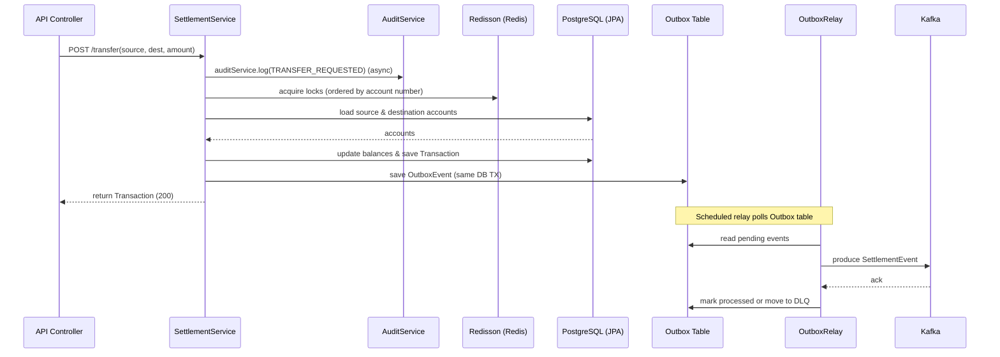
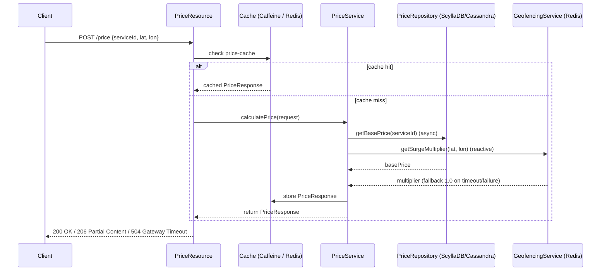

# Study Notes — Projects in this folder

Este documento reúne explicações técnicas e resumos de fluxo dos dois projetos presentes em /projects:
1) 01-clearing-settlement-engine
2) 02-dynamic-pricing-engine

Objetivo: ter material para estudar a arquitetura, principais classes/fluxos e decisões técnicas.

---

## 1) 01-clearing-settlement-engine — Resumo técnico

Visão geral
- Motor de clearing e liquidação: processa transferências entre contas, grava transações, mantém auditoria e publica eventos para consumidores (via Outbox → Kafka).
- Stack principal: Spring Boot (Java 21), PostgreSQL (JPA), Redis (Redisson), Kafka, Resilience4j, HikariCP, Actuator.

Principais componentes e fluxo (classe-chave / sequência):
- API Controller (não mostrado explicitamente nos trechos principais) → chama SettlementService.transfer(...)
- SettlementService.transfer(source, dest, amount)
  - auditService.log("TRANSFER_REQUESTED", ...) — chamada assíncrona para auditoria
  - Calcula ordem de locks (ordenação lexicográfica entre account numbers)
  - RedissonClient.getLock("lock:account:...") — adquire dois locks distribuídos (lock1, lock2) com tryLock(timeout)
  - Lê Account source/destination via AccountRepository
  - Validação de saldo, atualização de saldos e persistência (accountRepository.save)
  - Persiste Transaction via TransactionRepository (status COMPLETED)
  - Cria e salva OutboxEvent (payload = SettlementEvent JSON) em mesma transação
  - Retorna Transaction
- AuditService.log(...) — anotado com @Async e @Transactional: grava AuditLog em thread separada (evita deadlock de pool de conexões)
- OutboxRelay.processOutboxEvents() — @Scheduled a cada 5s
  - Busca OutboxEvent.processed = false
  - Desserializa payload → SettlementEvent
  - settlementProducer.sendSettlementEvent(settlementEvent) (envio ao Kafka)
  - Marca evento como processed / incrementa retryCount
  - Em falhas repetidas move para DLQ (OutboxDeadLetter)

Decisões técnicas importantes
- Virtual Threads (Java 21): permite alta concorrência e I/O eficiente. Usado para escalar número de requisições sem overhead de platform threads.
- Locks distribuídos Redisson: evita race conditions em contas; *ordering* lexicográfico elimina deadlocks clássicos.
- Outbox Pattern: escrita atômica no banco (registra evento junto com transação) + relay assíncrono → garante que DB e Kafka fiquem consistentes sem transações distribuídas.
- Audit assincrono (@Async): evita consumo de duas conexões concorrentes por requisição (problema com @Transactional + nested transactions) e previne starvation do Hikari pool.
- Resilience4j: retry/backoff e circuit breaker para chamadas a infra externa (ex.: Kafka produtores) garantindo resiliência.
- Dead-letter e retry counts: lógica para evitar tentativas infinitas e garantir visibilidade de eventos problemáticos.

Problemas encontrados e correções notáveis
- Connection starvation: uso de transações aninhadas para auditoria causou necessidade de 2 conexões por requisição → gerou deadlock com pool pequeno. Solução: fazer auditoria assíncrona com conexão separada / executor.

Arquivos-chave para estudar
- src/main/java/com/learning/clearing/service/SettlementService.java
- src/main/java/com/learning/clearing/service/AuditService.java
- src/main/java/com/learning/clearing/service/OutboxRelay.java
- clearing-settlement-engine.md (documentação presente no projeto)
- pom.xml (dependências: redisson, spring-kafka, resilience4j, actuator)

---

## 2) 02-dynamic-pricing-engine — Resumo técnico

Visão geral
- Engine de precificação dinâmica: calcula preço em tempo real combinando preço base (NoSQL) e multiplicador de surge por geofencing. Baixa latência, arquitetura reativa.
- Stack: Quarkus (reativo), Mutiny (Uni), Quarkus Redis reactive, Cache (Caffeine L1 + Redis L2 via quarkus-cache/quarkus-redis-cache), ScyllaDB/Cassandra driver (Quarkus CQL), Micrometer/Prometheus.

Principais componentes e fluxo (classe-chave / sequência):
- PriceResource (JAX-RS / Quarkus)
  - POST /price → valida coordenadas → chama PriceService.calculatePrice(request)
  - Timeout global: ifNoItem().after(500ms).failWith("Global Timeout")
  - Se falha por timeout responde 504; se warnings, responde 206 Partial Content
  - POST /price/admin/hotspot → geofencingService.addHotspot(...)
- PriceService.calculatePrice(request)
  - @CacheResult(cacheName = "price-cache") — caching L1 (in-memory) via Quarkus cache
  - Combina unis em paralelo: priceRepository.getBasePrice(serviceId) + geofencingService.getSurgeMultiplier(lat,lon)
  - Usa Uni.combine().all().unis(...).asTuple() para paralelizar e reduzir latência
  - Aplica fallback/timeouts: geofencingService.getSurgeMultiplier(...).onFailure().recoverWithItem(1.0).ifNoItem().after(50ms) → evita travamento da composição
  - Retorna PriceResponse com warnings quando fallback aplicado
- GeofencingService
  - Redis Geo: usa reactiveRedisDataSource.geo().geosearch(...) para detectar hotspots dentro de raio (2km)
  - addHotspot usa geoadd
- PriceRepository
  - Consulta base price em ScyllaDB/Cassandra via QuarkusCqlSession.executeAsync (retorna Uni)

Decisões técnicas importantes
- Arquitetura reativa (Quarkus + Mutiny): prioriza throughput e latência baixa, permite compor chamadas assíncronas de forma declarativa
- Cache L1 + L2: @CacheResult (Caffeine/Quarkus) para hits rápidos; Redis como cache distribuído e fonte de hotspots
- Uso de timeouts e fallback: cada dependência tem timeout curto e fallback (e.g., multiplier = 1.0) para garantir respostas mesmo com degradação parcial
- Combinação paralela de fontes: Uni.combine().all().unis(...) reduz p99 ao fazer fetch em paralelo
- Respostas parciais (HTTP 206) para sinalizar degradação controlada

Arquivos-chave para estudar
- src/main/java/com/example/pricing/PriceResource.java
- src/main/java/com/example/pricing/service/PriceService.java
- src/main/java/com/example/pricing/service/GeofencingService.java
- src/main/java/com/example/pricing/repository/PriceRepository.java
- pom.xml (Quarkus + Mutiny + Redis + Cassandra/Scylla deps)
- README.md (instruções e pontos do roadmap)

---

## Pistas de estudo e perguntas para investigar
- Revisar como o Outbox é persistido: quais campos da tabela OutboxEvent? (ver domain/model)
- Conferir configurações do Redisson e tempos de lock (tryLock timeouts) e implicações em latência
- Avaliar comportamento em falha: o que acontece se Kafka estiver indisponível por 30s? (ver Resilience4j config no application.properties / yaml)
- Entender configuração do HikariCP: mínimo/máximo pool, timeouts e como se relaciona com @Async em AuditService
- Em Dynamic Pricing: testar p99 com e sem cache; ajustar timeouts do getSurgeMultiplier

---

## Como rodar (rápido)
- Clearing: `mvn spring-boot:run` (ver docker-compose para PostgreSQL, Redis, Kafka). Executar scripts de stress: stress_test.py
- Pricing: `mvn package` + `java -jar target/...` ou usar `mvn quarkus:dev`; docker-compose (README) sobe Redis/Scylla

---

Se quiser, gero um diagrama de sequência simplificado (ASCII ou Mermaid) para cada fluxo (Transferência / Price calc) e adiciono links para os arquivos específicos na repo. Também posso extrair e listar as entidades JPA e campos principais para o estudo.

---

## Diagramas (Mermaid)

### Fluxo: Transferência / Clearing



*Tecnologias visíveis no diagrama*: Spring Boot, JPA/Postgres, Redisson (Redis locks), Outbox pattern (DB table), Kafka, Resilience4j, @Async audit service.

---

### Fluxo: Cálculo de Preço Dinâmico



*Tecnologias visíveis no diagrama*: Quarkus + Mutiny (Uni), Caffeine L1 + Redis L2 cache, Reactive Redis geo APIs, ScyllaDB/Cassandra (Quarkus CQL client), timeouts/fallbacks e uso de Uni.combine() para paralelismo.

---

Se quiser, adiciono também versões Mermaid com comentários de tempos/timeout (p.ex. tryLock timeouts, cache TTLs e deadlines) ou diagramas de componente (arquitetura infra: docker-compose).

---

## Diagrama de Componentes (Mermaid)

Abaixo um diagrama de componentes que mostra os serviços das duas aplicações e os componentes de infraestrutura que interagem com eles. Use este bloco Mermaid em renderizadores compatíveis (GitHub/GitLab/Obsidian) para visualizar graficamente.

```mermaid
graph TD
  subgraph ClearingApp[Clearing & Settlement Engine]
    CS_API[API Controller (Spring Boot)]
    CS_Service[SettlementService]
    CS_Audit[AuditService (@Async)]
    CS_Outbox[Outbox Table]
    CS_Relay[OutboxRelay (@Scheduled)]
  end

  subgraph PricingApp[Dynamic Pricing Engine]
    PR_API[PriceResource (Quarkus)]
    PR_Service[PriceService]
    PR_Geo[GeofencingService (Reactive Redis)]
    PR_Cache[Local Cache (Caffeine) / Redis L2]
  end

  subgraph Infra[Infraestrutura]
    Postgres[(PostgreSQL / JPA)]
    Redis[(Redis - locks, geo, cache)]
    Kafka[(Kafka - eventos)]
    Scylla[(ScyllaDB / Cassandra)]
    Prometheus[(Prometheus / Metrics)]
  end

  %% Clearing flow
  CS_API -->|HTTP /transfer| CS_Service
  CS_Service -->|JDBC / JPA| Postgres
  CS_Service -->|Redisson locks| Redis
  CS_Service -->|escreve outbox| CS_Outbox
  CS_Service --> CS_Audit
  CS_Relay -->|lê outbox| CS_Outbox
  CS_Relay -->|produce| Kafka

  %% Pricing flow
  PR_API -->|HTTP /price| PR_Service
  PR_Service -->|cache read/write| PR_Cache
  PR_Service -->|CQL async| Scylla
  PR_Service -->|geo lookup| PR_Geo
  PR_Geo --> Redis

  %% Common infra connections
  Postgres --> Prometheus
  Redis --> Prometheus
  Kafka --> Prometheus
  Scylla --> Prometheus

  %% Notes
  CS_Outbox --> Postgres
  CS_Audit --> Postgres

  style ClearingApp fill:#f9f,stroke:#333,stroke-width:1px
  style PricingApp fill:#bbf,stroke:#333,stroke-width:1px
  style Infra fill:#efe,stroke:#333,stroke-width:1px
```

Observações rápidas:
- O diagrama enfatiza integrações (JDBC/JPA, Redisson, Kafka, Redis geo) e componentes de observabilidade (Prometheus).
- Pode ser estendido com portas, docker-compose services e paths de configuração se desejar.
